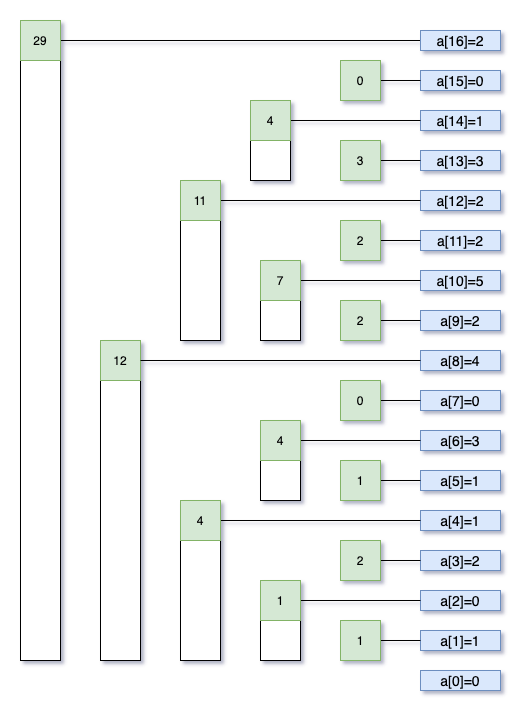
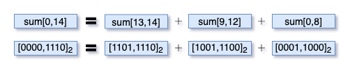

# 何为BIT
BIT是一种数据结构，名为树其实用数组即可表达。其主要作用是给定了一个数组(或多维数组)，BIT可用来：

- `O(logN)`的复杂度计算给定范围的和,也就是求sum(low, high)
- `O(logN)`的复杂度更新数组的一个元素

其构造方法巧妙但简单，可谓大道至简。
- 给定一个数组`a[0 ... N-1]`,长度`N`。
- BIT表示为`indexes[0 ... N]`,长度`N+1`。`indexes[i]=sum(g(i) ... i], g(i)=i-i&(-i)`，注意是左开右闭区间。`i&(-i)`得到的是一个数字的二进制表示中只留下最右的`1`后的数字，比如`12=[1100]`,则`12&(-12)`只留下最右的`1`就成了`4=[0100]`。

注意到`indexes[]`从`1`开始计数，所以始终有`indexes[0]=0`。为了说明方便，在数组`a[]`前面添加了个元素`0`。



看图说话，如此构造后，原数组的和`sum[0 ... i]`就可以通过把能覆盖`range[0 ... i]`的`indexes[]`加起来得到。比如求`sum[0 ... 14]`，步骤如下，辅以图示。
1. 先加上`indexes[14]`，覆盖了`a[14], a[13]`。
2. `14=[1110]`,最右`1`留下后是`2=[10]`,减去后得到`12`,加上`indexes[12]`。
3. `12=[1100]`,最右`1`留下后是`4=[100]`,减去后得到`8`,加上`indexes[8]`。
4. `8=[1000]`,最右`1`留下后是`8=[1000]`,减去后得到`0`，结束。



所以何为BIT,其本质是通过原数组构造一个新数组`indexes[]`，其中**每个元素表示原数组中一段连续子数组的和**。范围求和就从线性遍历原数组(`O(N)`)，变成了在`indexes[]`中快速查找(`O(logN)`)能覆盖所求范围的那几个元素。

而更新则是与求和相反的一个过程,原数组一个元素`a[i]`更新后，首先需要更新`indexes[i]`，然后要不停向上，更新每个覆盖了`a[i]`的`indexes`元素。比如,`a[9]=2 -> a[9]=10`,则有：
1. 计算一个更新`delta`, `delta=10-2`，更新`indexes[9]+=delta`,
2. `9=[1001]`,最右`1`留下后是`1=[0001]`,加上后得到`10`,更新`indexes[10] += delta`。
3. `10=[1010]`,最右`1`留下后是`2=[0010]`,加上后得到`12`,更新`indexes[12] += delta`。
4. `12=[1100]`,最右`1`留下后是`4=[0100]`,加上后得到`16`,更新`indexes[16] += delta`。

代码如下:
```java
class BIT {
    private int[] indexes;
    private int[] nums;
    public BIT(int[] nums) {
        this.nums = nums;
        indexes = new int[nums.length + 1];

        for (int i = 0; i < nums.length; i++) {
            add(i + 1, nums[i]);
        }
    }

    // Update: nums[i]=val.
    public void update(int i, int val) {
        int delta = val - nums[i];
        add(i + 1, delta);
        nums[i] = val;
    }

    // Get sum[i ... j].
    public int query(int i, int j) {
        return query(j + 1) - query(i);
    }

    // Get sum[0 ... i-1].
    private int query(int i) {
        int sum = 0;
        while (i > 0) {
            sum += indexes[i];
            i -= lowBit(i);
        }
        return sum;
    }

    // Add: nums[i] += delta.
    private void add(int i, int delta) {
        while (i < indexes.length) {
            indexes[i] += delta;
            i += lowBit(i);
        }
    }

    private int lowBit(int i) {
        return i & (-i);
    }
}
```

# 两个变招
上面介绍的最基本的索引树支持两项操作，单点更新和范围索引(此处是求和)。在此基础上，可以稍加改变即可支持范围更新和单点索引,更进一步,可以支持范围更新和范围索引。
## 范围更新和单点索引
上面代码中的`update(i, val)`每次只能更新一个元素，如果要更新一个范围内所有元素呢,比如给`nums[low...high]`都加上`val`。一个方法是一个个更新，复杂度`O(mlogN)`,`m`是范围长度。
```java
public void add(int low, int high, int val) {
    for (int i = low; i <= high; ++i) {
      add(i+1, val);
    }
}
```

有没有可能`O(logN)`实现范围更新？可以，通过两次单点更新实现，`add(low, val)`和`add(high+1, -val)`。原理是，
- `add(low, val)`影响`indexes[j], j >= low`，每个范围和都增加`val`。
- `add(high+1, -val)`影响`indexes[j], j > high`，每个范围和减掉`val`。
- 最终的效果是，对于`indexes[j], low <= j <= high`，范围和增加`val`。而对于`indexes[j], j > high`，一增一减正好抵消。

注意此处的`indexes[]`初始化为`0`,表示的是原数组更新后差值的范围和。

代码如下:
```java
class BIT {
    private int[] indexes;
    private int[] nums;
    public BIT(int[] nums) {
        this.nums = nums;
        indexes = new int[nums.length + 1];
    }

    // Get nums[i].
    public int query(int i) {
        int sum = 0;
        ++i;
        while (i > 0) {
            sum += indexes[i];
            i -= lowBit(i);
        }
        return sum + nums[i];
    }

    // Add val to nums[low ... high]
    public void add(int low, int high, int val) {
      add(low, val);
      add(high+1, -val);
    }

    // Add val to nums[i]
    private void add(int i, int val) {
      ++i;
      while (i < indexes.length) {
          indexes[i] += val;
          i += lowBit(i);
      }
    }

    private int lowBit(int i) {
        return i & (-i);
    }
}
```
这个实现导致只能单点索引某个元素而不能索引范围和了。既支持范围更新又支持范围索引的BIT也是存在的，但需要构造两个索引数组。

## 范围更新与范围索引
此变招要义在于通过两个`indexes[]`索引数组来构造最终的和。试想，在`add(low, high, val)`后，我们希望得到的求和`sum[0...i]`应该如以下所示：
- `i < low`,则`sum[0...i] = 0`，因为`nums[0...low)`没任何增减。
- `low <= i <= high`,则`sum[0...i]= val * (i - low + 1)`,因为`nums[low...i]`都增加了`val`.
- `i > high`,则`sum[0...i] = val * (high - low + 1)`,因为只有`nums[low...high]`增加了`val`.

以上结构可通过`indexes1[]`和`indexes2[]`组合构造:

对于`indexes1[i], low <= i <= high`，范围和增加`val`。`query(indexes1, i) * i`有：
- `i < low`, 则`query(indexes1, i) = 0`, 从而`query(indexes1, i) * i = 0`.
- `low <= i <= high`, 则`query(indexes1, i) = val`,从而`query(indexes1, i) * i = val * i`.
- `i > high`, 则`query(indexes1, 1) = 0`, 从而`query(indexes1, i) * i = 0`.

对于`indexes2[i]`,每次`add(low, high, val)`，都有:
```java
add(indexes2, low, val * (low - 1));
add(indexes2, high + 1, -val * high);
```

意味着，

- `i < low`, 则`query(indexes2, i) = 0`
- `low <= i <= high`, 则`query(indexes2, i) = val * (low - 1)`
- `i > high`, 则`query(indexes2, 1) = val * (low - 1) - val * high`

结合起来,`query(indexes1, i) * i - query(indexes2, i)`就得到了我们希望的`sum[0...i]`，我就问你是不是很精妙？

```java
class BIT {
    private int[] indexes1;
    private int[] indexes2;
    private int[] nums;
    public BIT(int[] nums) {
        this.nums = nums;
        indexes1 = new int[nums.length + 1];
        indexes2 = new int[nums.length + 1];
        for (int i = 0; i < nums.length; ++i) {
          add(i, i, nums[i]);
        }
    }

    // Add val to nums[low ... high]
    public void add(int low, int high, val) {
      add(indexes1, low, val);
      add(indexes1, high + 1, -val);
      add(indexes2, low, val * (low - 1));
      add(indexes2, high + 1, -val * high);
    }

    // Add val to nums[i].
    private void add(int[] indexes, int i, int val) {
      ++i;
      while (i < indexes.length) {
          indexes[i] += val;
          i += lowBit(i);
      }
    }

    // Get sum[low ... high].
    public int sum(int low, int high) {
      return sum(high) - sum(low - 1);
    }

    // Get sum[0 ... i].
    public int sum(i) {
      return query(indexes1, i) * i - query(indexes2, i);
    }

    // Query sum of add[0 ... i] for indexes[].
    private int query(int[] indexes, int i) {
        int sum = 0;
        ++i;
        while (i > 0) {
            sum += indexes[i];
            i -= lowBit(i);
        }
        return sum;
    }

    private int lowBit(int i) {
        return i & (-i);
    }
}
```

## 二维BIT
最常规也就是单点更新和范围索引的BIT可以推广到二维，即给定一个二维数组`a[N][M]`，建立其对应的二维BIT,`indexes[N+1][M+1]`，闲话少叙，直接上代码，看到更新和索引中的迭代及终止条件就是一维的单循环到二维的双层循环的简单推广。
```java
class BIT2D {
    private int[][] indexedTree;
    private int[][] matrix;
    private int rowLen = 0;
    private int colLen = 0;

    public BIT2D(int[][] matrix) {
        rowLen = matrix.length;
        if (rowLen == 0) {
            return;
        }
        colLen = matrix[0].length;
        if (colLen == 0) {
            return;
        }

        this.matrix = new int[rowLen][colLen];
        indexedTree = new int[rowLen + 1][colLen + 1];

        for (int i = 0; i < matrix.length; i++) {
            for (int j = 0; j < matrix[0].length; j++) {
                update(i, j, matrix[i][j]);
            }
        }
    }

    public void update(int row, int col, int val) {
        if (rowLen == 0 || colLen == 0) {
            return;
        }

        int delta = val - matrix[row][col];
        matrix[row][col] = val;
        for (int i = row + 1; i <= matrix.length; i += lowBit(i)) {
            for (int j = col + 1; j <= matrix[0].length; j += lowBit(j)) {
                indexedTree[i][j] += delta;
            }
        }
    }

    public int sumRegion(int row1, int col1, int row2, int col2) {
        if (rowLen == 0 || colLen == 0) {
            return 0;
        }

        return getSumRegion(row2, col2) -
            getSumRegion(row2, col1 - 1) -
            getSumRegion(row1 - 1, col2) +
            getSumRegion(row1 -  1, col1 - 1);
    }

    // Get sum[0...row][0...col], i.e.,
    // the rectangle with top left vertex [0,0] and right bottom vertex [row, col].
    private int getSumRegion(int row, int col) {
        int sum = 0;
        for (int i = row + 1; i > 0; i -= lowBit(i)) {
            for (int j = col + 1; j > 0; j -= lowBit(j)) {
                sum += indexedTree[i][j];
            }
        }
        return sum;
    }

    private int lowBit(int i) {
        return i & (-i);
    }
}
```