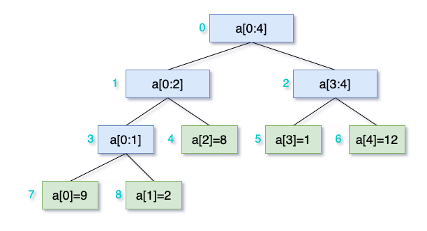

# 何为线段树
线段树是基于要研究的数组而构建的数据结构，呈二叉树状。线段树的叶子结点就是所要研究的数组，非叶子节点表示数组的一段区间的某个性质的值。比如此区间的和，或者最大值最小值等等。

为什么需要线段树呢？试想你需要设计一个功能，给定一个数组，需要你提供两个操作，一是更改某个元素，而是索引某个区间的和，或者最大值，或者最小值，这里以和举例。最直接也是最简单做法当然是直接在数组上操作，`O(1)`更新，`O(N)`索引和，`N为区间长度`。
```java
class NumArray {
  public NumArray(int[] nums) { //TODO }

  // Updates nums[index] = val.
  public void update(int index, int val) { //TODO}

  // Gets sum of nums[left ... right].
  public int query(int left, int right) { //TODO }
}
```
再进一步，如果需要更新一个区间的元素呢，比如，`nums[i] += val, for left <= i <= right`。
```java
class NumArray {
  // ...

  // Add val, for nums[i] with left <= i <= right
  public int add(int left, int right, int val) { //TODO }
}
```

继续以上方法，就是遍历区间，一一更新，与索引相同复杂度:`O(N)`。

有没有能索引复杂度的方法？有，线段树就是其中一种，通过构造线段树，可以将索引复杂度降低到`O(logN), N为区间长度`，但会增加`update`复杂度到`O(logN),N为原数组长度`。而一般的应用场景，读远大于写，所以这个改进非常有益于整体性能提升。

那如何构造线段树呢?可以通过数组表示，也可以通过一棵树来表示。先说数组表示法。

# 基于数组的线段树

给定的研究数组`a[]`，长度为`N`，线段树用数组`tree[]`表示，则有：

- 根节点为`tree[0]`，覆盖数组范围`a[0 ... N-1]`。
- 根的左孩子`tree[1]`,覆盖范围是父节点前一半，即`a[0 ... N/2]`。有孩子`tree[2]`,覆盖范围父节点后一半，即`a[N/2 + 1 ... N-1]`。
- 上面两步不断重复，即对于节点`tree[i], range[l ... r]`，令`mid=(l+r)/2`则有左孩子`tree[2*i+1], range[l ... mid]`,右孩子`tree[2*i+2], range[mid+1, r]`。
- 如此递归构造知道叶子节点`tree[i], range[l ... r]`,此时`l == r`,则令`tree[i]=the desired value`。

代码如下：
```java
class SegmentTree {
    private int[] tree;
    private int n;

    public SegmentTree(int n) {
        this.n = n;
        int len = (1 << (1 + (int)(Math.ceil(Math.log(n) / Math.log(2))))) - 1;
        tree = new int[len];
    }

    public int query(int left, int right) {
        return queryCore(left, right, 0, n - 1, 0);
    }

    public void update(int left, int right, int newVal) {
        updateCore(left, right, 0, n - 1, 0, newVal);
    }

    private int queryCore(int left, int right, int segLeft, int segRight, int index) {
        if (left > segRight || right < segLeft) {
            return 0;
        }

        if (left <= segLeft && segRight <= right) {
            return tree[index];
        }

        int mid = getMid(segLeft, segRight);
        return merge(queryCore(left, right, segLeft, mid, index * 2 + 1),
            queryCore(left, right, mid + 1, segRight, index * 2 + 2));
    }

    private void updateCore(int left, int right,
                            int segLeft, int segRight, int index, int newVal) {
        if (left > segRight || right < segLeft) {
            return;
        }

        if (segLeft == segRight) {
            tree[index] = newVal;
            return;
        }

        int mid = getMid(segLeft, segRight);
        updateCore(left, right, segLeft, mid, index * 2 + 1, newVal);
        updateCore(left, right, mid + 1, segRight, index * 2 + 2, newVal);

        tree[index] = merge(tree[2 * index + 1], tree[2 * index + 2]);
    }

    // Depending on the query, it can be sum, max, min, etc of an interval.
    // Here is sum of interval.
    private int merge(int leftVal, int rightVal) {
      return leftVal + rightVal;
    }

    private int getMid(int left, int right) {
        return left + (right - left) / 2;
    }
}

```
如果给定了一个数组`a[]`，则基于构造此数组的线段树调用方式为:
```java
SegmentTree tree = new SegmentTree(a.length);
for (int i = 0; i < a.lenght; ++i) {
  tree.update(i, i, a[i]);
}
```
结合以上代码与下图可以走一遍构造过程。


大家可能疑问了，这个`tree[]`长度为什么这么计算？很简单，可以看到所构造的线段树是一棵完全二叉树，注意不一定满。其叶子节点共有`N`个，假设最终的深度为`h`,则有`2^h = N`,所以`h = logN`。接下来就是等比求和`1+2+4+...+2^h = 2^(1+h) - 1`。因为不一定是满二叉树，所以要`logN`往上取整。这也说明，会有一些节点永远不会被用到而浪费空间。

回顾下用`BIT`解决的[Leetcode 307. Range Sum Query](https://leetcode.com/problems/range-sum-query-mutable/)，也可以用线段树来解。代码如下，时间复杂度一致，但空间复杂度线段树更大，不多赘述。

```java
class NumArray {
  private SegmentTree tree;
  public NumArray(int[] nums) {
    tree = new SegmentTree(nums.length);
    for (int i = 0; i < nums.length; ++i) {
      tree.update(i, i, nums[i]);
    }
  }

  public void update(int index, int val) {
    tree.update(index, index, val);
  }

  public int sumRange(int left, int right) {
    return tree.query(left, right);
  }
}
```

# 基于二叉树的线段树
前面介绍了基于数组的线段树，灵活但不直观。其实看上图就可以推测，完全可以用二叉树来构造线段树。直接上代码，可以看到，基于二叉树后，初始化线段树只需要初始化一个空节点作为根，甚至可以只记录下`N`，然后用到时再初始化`root`也行。

```java
class SegmentTree {
    private Node root;

    public SegmentTree(int N) {
        this.root = new Node(0, 0, N - 1);
    }

    public int query(int left, int right) {
        return queryCore(left, right, root);
    }

    public void update(int left, int right, int newVal) {
        updateCore(left, right, root, newVal);
    }

    private int queryCore(int left, int right, Node cur) {
        if (left > cur.high || right < cur.low) {
            return 0;
        }

        if (left <= cur.low && cur.high <= right) {
            return cur.val;
        }

        return merge(queryCore(left, right, cur.left),
            queryCore(left, right, cur.right));
    }

    private void updateCore(int left, int right, Node cur, int newVal) {
        if (left > cur.high || right < cur.low) {
            return;
        }

        if (cur.low == cur.high) {
            cur.val = newVal;
            return;
        }

        int mid = getMid(cur.low, cur.high);
        if (cur.left == null) {
            cur.left = new Node(0, cur.low, mid);
        }
        if (cur.right == null) {
            cur.right = new Node(0, mid + 1, cur.high);
        }
        updateCore(left, right, cur.left, newVal);
        updateCore(left, right, cur.right, newVal);

        cur.val = merge(cur.left.val, cur.right.val);
    }

    // Depending on the query, it can be sum, max, min, etc of an interval.
    // Here is sum of interval.
    private int merge(int leftVal, int rightVal) {
      return leftVal + rightVal;
    }

    private int getMid(int left, int right) {
        return left + (right - left) / 2;
    }

    static class Node {
        // The value for range [low ... high].
        public int val;
        public int low;
        public int high;
        public Node left = null;
        public Node right = null;

        public Node(int val, int low, int high) {
            this.val = val;
            this.low = low;
            this.high = high;
        }
    }
}
```

# 线段树的应用
上面举例，线段树都是用于求和，也可用于其他，比如数组区间的最大值，最小值，等等。所需要的修改非常简单，只需要更改`merge`方法。比如改为针对最大值的线段树，则只需作如下修改：
```java
private int merge(int leftVal, int rightVal) {
  return Math.max(leftVal, rightVal);
}
```
其他一概不动，当然是有前提的，基于索引数组区间的性质，可能需要改动线段树初始化值。比如在求和时，我们把未初始化的节点(或者叫`null`节点)值默认为`0`，这是合理的，因为加`merge`的参数中如果有`null`节点，则加`0`对结果没有影响。

如果是求最大值，则初始化时，为了让`merge null`节点对最终结果没影响，应该很容易想到，`null`节点默认值应该为`MIN`,如此`max(val, MIN)`肯定返回`val`。

线段树虽然比BIT费空间，但比BIT灵活。记住，多做的功不会白费，总会在某个地方回馈。一碗线段树鸡汤送给你。